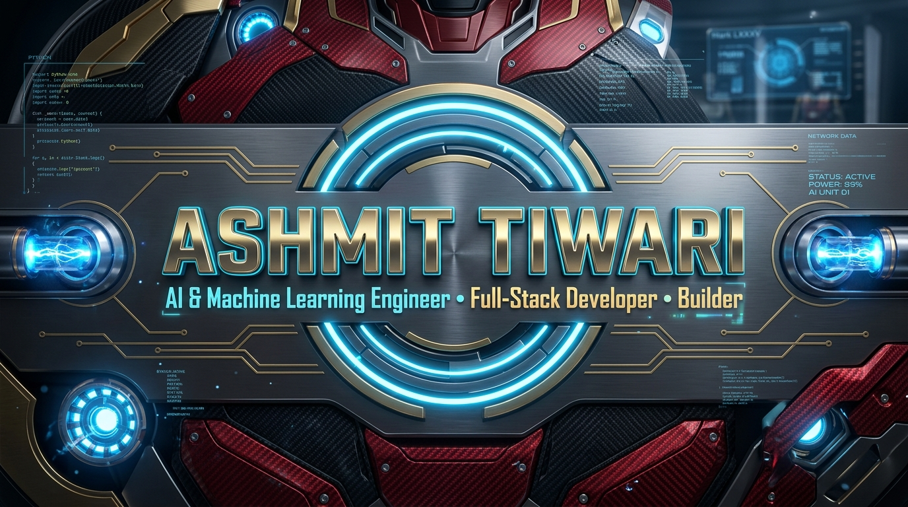

<div align="center">

  <!-- HERO BANNER -->
  

  <br /><br />

  <!-- DYNAMIC TYPING HEADER -->
  <a href="https://github.com/Ashmit-tiwari">
    
  </a>

  <p align="center">
    <a href="mailto:ashmittiwwari@gmail.com"></a>
    <a href="https://www.linkedin.com/in/ashmit-tiwari-726098319" target="_blank"></a>
    <a href="https://www.instagram.com/ashmit_tiwari_2911" target="_blank"></a>
    <a href="https://github.com/Ashmit-tiwari"></a>
  </p>

</div>

---

### 👨‍💻 About Me

I am an **AI & Machine Learning Engineering undergraduate** at **Chandigarh University**, passionate about building complete, useful products from scratch.

My engineering journey bridges the gap between **robust backend systems, modern full-stack web applications, and intelligent AI/ML algorithms**. I believe in disciplined engineering: understanding core algorithmic foundations and transforming ideas into production-ready software.

* 🎓 **Education**: B.Tech in Artificial Intelligence & Machine Learning, *Chandigarh University*
* 💻 **Core Focus**: Python Development • Full-Stack Web Applications • Machine Learning Foundations
* 🧭 **Engineering Trajectory**: `Python Fundamentals` → `Data Structures & Algorithms` → `Backend Systems` → `Full-Stack Architecture` → `Applied AI/ML`
* 💡 **Mindset**: Learn deeply, build cleanly, test thoroughly, and ship real solutions.

---

### 🚀 Currently Building

```text
┌── [Active Engineering Focus]
├── 🌐 Full-stack web platforms with modern React / Next.js & PostgreSQL
├── 🧠 Applied Machine Learning experiments & predictive modeling with Python
├── ⚙️ Robust backend architectures, RESTful APIs, and database integrations
└── 🧩 Algorithm design, algorithmic optimization, and competitive coding
```

---

### 🛠️ Tech Stack & Tooling

<div align="center">

#### Languages
<p>
  
  
  
  
</p>

#### AI & Data Science
<p>
  
  
  
  
  
</p>

#### Web & Full-Stack Development *(Actively Learning & Building)*
<p>
  
  
  
  
  
</p>

#### Databases & Cloud Backend
<p>
  
  
  
  
</p>

#### Developer Workflow & Tools
<p>
  
  
  
  
  
</p>

</div>

---

### 🗺️ Engineering Learning Path

```mermaid
graph LR
    A[Python Fundamentals] --> B[Object-Oriented Programming]
    B --> C[Data Structures & Algorithms]
    C --> D[Backend & Database Systems]
    D --> E[Full-Stack Architecture]
    E --> F[Machine Learning Foundations]
    F --> G[Deep Learning & Neural Networks]
    G --> H[End-to-End AI Engineering]
    
    style A fill:#1e1b4b,stroke:#6366f1,stroke-width:2px,color:#fff
    style B fill:#1e1b4b,stroke:#6366f1,stroke-width:2px,color:#fff
    style C fill:#1e1b4b,stroke:#6366f1,stroke-width:2px,color:#fff
    style D fill:#311042,stroke:#a855f7,stroke-width:2px,color:#fff
    style E fill:#311042,stroke:#a855f7,stroke-width:2px,color:#fff
    style F fill:#0f2b38,stroke:#06b6d4,stroke-width:2px,color:#fff
    style G fill:#0f2b38,stroke:#06b6d4,stroke-width:2px,color:#fff
    style H fill:#134e4a,stroke:#10b981,stroke-width:2px,color:#fff
```



---

### 🔥 Featured Projects

<table>
  <tr>
    <td width="50%" valign="top">
      <h3 align="left">⚡ Coding Challenge Platform</h3>
      <p>Full-stack competitive programming platform with automated test runners, dynamic certification engine, leaderboard, and live anti-cheat integrity monitoring.</p>
      <p>
        
        
        
        
      </p>
      <p>
        <a href="https://github.com/Ashmit-tiwari/coding-challenge-platform" target="_blank"><b>View Repository →</b></a>
      </p>
    </td>
    <td width="50%" valign="top">
      <h3 align="left">🌐 Elevate — Social Media Platform</h3>
      <p>Modern social networking platform designed for seamless user interaction, dynamic content feeds, profiles, and responsive real-time engagement.</p>
      <p>
        
        
        
        
      </p>
      <p>
        <a href="https://github.com/Ashmit-tiwari" target="_blank"><b>View Repository →</b></a>
      </p>
    </td>
  </tr>
</table>

---

### 📈 GitHub Analytics

<div align="center">
  <table border="0">
    <tr>
      <td align="center">
        
      </td>
      <td align="center">
        
      </td>
    </tr>
    <tr>
      <td colspan="2" align="center">
        
      </td>
    </tr>
  </table>
</div>

---

### 🏆 Achievements & Certifications

* 📜 **B.Tech Artificial Intelligence & Machine Learning** — *Chandigarh University*
* 🏅 **Coding Challenge Platform Architect** — *AIML Club & byteXL Integration*
* 🎯 **Algorithmic Problem Solving & Data Structures** — *Continuous Practice*

---

### 🌱 Currently Exploring & Mastering

* **Deepening Computer Science Foundations**: Advanced Data Structures, Algorithmic Complexity, and Optimization.
* **Applied Machine Learning**: Supervised/Unsupervised learning workflows, feature engineering, and model evaluation.
* **Full-Stack Architecture**: State management patterns, database indexing, and REST API performance.

---

### 💭 Engineering Philosophy

> *"Code is a medium for problem solving. Understand the fundamentals, write maintainable code, test edge cases, and continuously iterate toward excellence."*

---

### 🤝 Let's Connect & Collaborate

I am open to collaborating on:
- 💡 **AI/ML projects & experimentation**
- 🌐 **Full-stack web application development**
- 🚀 **Open-source software & developer tools**
- 🏆 **Hackathons & technical problem-solving teams**

<div align="center">

  <a href="mailto:ashmittiwwari@gmail.com">
    
  </a>
  <a href="https://www.linkedin.com/in/ashmit-tiwari-726098319" target="_blank">
    
  </a>
  <a href="https://www.instagram.com/ashmit_tiwari_2911" target="_blank">
    
  </a>
  <a href="https://github.com/Ashmit-tiwari">
    
  </a>

</div>

<br />

<div align="center">
  <sub>Designed with a dark developer aesthetic for <b>Ashmit Tiwari</b> • Built with GitHub Markdown & SVG integrations</sub>
</div>
